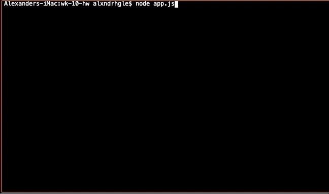
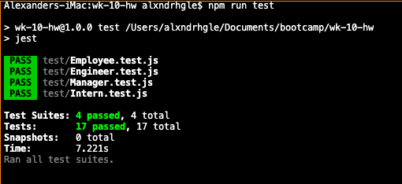

# Template Engine - Employee Summary

Node CLI for inputting employee information and having it displayed on a responsive web page. Upon initializing the program, the user is able to input a manager name, email, and office number. The user can then add additional employees (engineers or interns) that are under the manager's supervision. Engineer information requires a name, email, and GitHub username whereas intern information takes in a name, email, and school name. Once all the desired employees are entered, the program builds a responsive webpage that the user is able to view.

Tests are included to ensure that the program runs as expected.

## Prerequisites

1. Node.js

## Installing

1. Clone repository
2. npm install dependencies
3. Run app.js to start application

## Built With

- [Node.js](https://nodejs.org/en/) - JavaScript server environment

### npm Packages

- jest

## Sample Usage

## Test Suite

## Output Example

